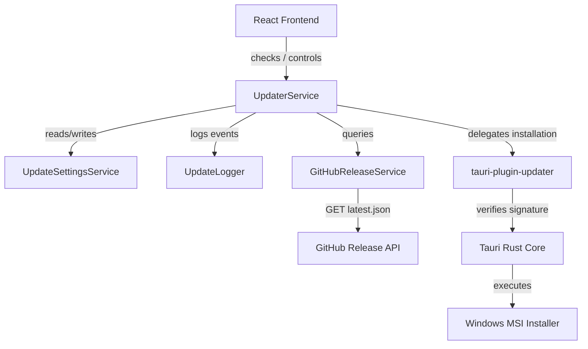

# In-App Software Updater Service Architecture

This document describes the design, implementation, and operational mechanics of the in-app software updater built for the Tauri-based Sales Monitoring System.

## Architecture Diagram

## System Responsibilities

The system divides responsibilities between the TypeScript application layer, the Rust backend, and the native Tauri framework:

1. **Vite Frontend / React UI**:
   - Manages state machine transitions (`Idle -> Checking -> UpdateAvailable -> Downloading -> ...`).
   - Renders update progress bar with real-time download calculations (ETA, speed, downloaded bytes).
   - Exposes user preferences (Update channel, Check schedule, Skip version).
   - Queries rich release notes directly from the GitHub API and caches them for 24 hours.

2. **Rust Backend (`src-tauri/src/lib.rs` & `maintenance_commands.rs`)**:
   - Generates compile-time constants (`APP_VERSION`, `BUILD_NUMBER`, `GIT_HASH`, etc.) using `build.rs` to display precise diagnostic statistics.
   - Exposes static configuration parameters via `get_updater_endpoints` to maintain `tauri.conf.json` as the single source of truth.
   - Exposes diagnostic values (OS version, WebView2 version, Tauri version, logs/app data directories) to the frontend via `get_diagnostics_info`.
   - Implements `check_for_updates_custom` and `install_pending_update_custom` commands:
     - `check_for_updates_custom` dynamically configures the updater with the channel-specific manifest URL, performs native check/signature verification/platform arch matching, and caches the resulting `Update` struct in a safe memory state.
     - `install_pending_update_custom` executes the cached update installer while emitting progress events.

3. **Native Tauri Framework**:
   - Performs cryptographic signature verification (Ed25519) of update packages before launching installers.
   - Handles the actual file stream downloads and executes the silent MSI installer command.
   - Manages application process restarts cleanly.

## State Machine Lifecycle

The update lifecycle moves through 11 distinct states:

* **Idle**: Waiting for triggers.
* **Checking**: Fetching update manifest from the server.
* **NoUpdate**: Manifest checked; version is up to date or version was skipped.
* **UpdateAvailable**: New version detected; release notes are presented to the user.
* **Downloading**: Actively downloading update package.
* **Downloaded**: Package completely fetched.
* **Installing**: Executing verification and MSI installer.
* **Installed**: Installation completed successfully.
* **RestartRequired**: Prompting user to restart the application.
* **Cancelled**: Operation aborted by the user.
* **Failed**: Operation terminated due to network, validation, or install errors.

## Settings Persistence

Updater preferences are stored inside the SQLite database using key-value entries:
- `updater_auto_check` (default `1`)
- `updater_channel` (default `Production`, supports `Preview` and `Internal`)
- `updater_check_schedule` (default `startup`, supports `daily` and `weekly`)
- `updater_skipped_version` (contains skipped tag name, e.g. `2.5.0`)
- `updater_last_check_time` (ISO timestamp of the last check)

Data persistence is consolidated:
- **Tauri Desktop app**: SQLite is the single source of truth. An in-memory cache is used during startup or migrations to hold keys temporarily and avoid double-write data drift.
- **Web Browser environment**: LocalStorage is used only if `window.__TAURI__` is undefined (web target preview).
- **Target Selection**: Channel selection dynamically routes update checks by passing the channel name to the custom Rust command `check_for_updates_custom`, which parses the correct URL and invokes `updater_builder().endpoints(...)` to verify signatures and architecture platform keys natively.
